# How Push Notifications Work in Glass News

This document explains the end-to-end architecture of the Push Notification system in Glass News, enabling real-time updates on iOS (PWA), Android, and Desktop.

## Architecture Overview

The system consists of three main parts:
1.  **Frontend (PWA)**: Handles permissions and generates the subscription token.
2.  **Backend (Cloudflare Worker)**: Stores subscriptions and triggers pushes.
3.  **Push Service**: Intermediary servers (Apple APNs, Google FCM, Mozilla) that deliver the message to the device.

---

## 1. The Frontend (Client-Side)

**File:** `glass-news/app.js` & `glass-news/sw.js`

### Step A: Permission & Subscription
When the user taps the 🔔 bell icon:
1.  **Check Permissions**: The app asks the browser for permission (`Notification.requestPermission()`).
2.  **Get Service Worker**: It waits for the Service Worker to be `ready`.
3.  **Subscribe to Push Manager**:
    *   It calls `registration.pushManager.subscribe()`.
    *   It passes our **VAPID Public Key** (`applicationServerKey`).
    *   **Result**: The browser talks to its native Push Service (e.g., Apple APNs) and returns a `PushSubscription` object containing:
        *   `endpoint`: A unique URL for that specific device (e.g., `https://web.push.apple.com/...`).
        *   `keys`: Encryption keys (`p256dh`, `auth`) to ensure only we can read the message.

### Step B: Sync with Backend
The PWA takes this subscription object and sends it to our backend:
```javascript
POST /api/subscribe
Body: { endpoint: "...", keys: { ... } }
```

### Step C: Receiving Messages
The Service Worker (`sw.js`) listens in the background, even when the app is closed (if supported by OS):
```javascript
self.addEventListener('push', (event) => {
    // Decrypts payload and shows native system notification
    self.registration.showNotification(title, options);
});
```

---

## 2. The Backend (Server-Side)

**File:** `src/index.ts` (Cloudflare Worker)

### Storage (Cloudflare KV)
We use Cloudflare KV (Key-Value storage) as our database.
*   **Key**: `sub:{BASE64_ID}` (Derived from the unique endpoint).
*   **Value**: The full JSON subscription object.

### The Sending Process
We use the VAPID (Voluntary Application Server Identification) protocol to authenticate ourselves to Apple/Google. This prevents unauthorized people from spamming our users.

#### A. Manual Trigger (`/api/test-push`)
Used for debugging.
1.  **Load Subscriptions**: Fetches all keys starting with `sub:` from KV.
2.  **Parallel Execution**: Uses `Promise.allSettled` to send to all users simultaneously.
3.  **Custom VAPID Implementation**:
    *   We use the `web-push` library to **generate headers** (Authorization token signed with our Private Key).
    *   We use the native Cloudflare `fetch` API to **send the POST request** to the user's `endpoint`.
    *   *Note: We bypassed `web-push`'s internal networking because it relies on Node.js APIs not available in Workers.*
4.  **Error Handling**:
    *   If a server responds with `410 Gone` or `404 Not Found`, it means the user realized the subscription (uninstalled/revoked). We **delete** it from KV automatically.

#### B. Scheduled Cron (`scheduled()`)
Runs automatically every 2 hours.
1.  **Crawl**: Fetches new articles (HackerNews, T24, etc.).
2.  **Process**: Generates AI summaries and thumbnails.
3.  **Notify**: If new articles are found, it triggers the same push logic as above to alert all subscribers.

---

## 3. VAPID Keys (Security)

*   **Public Key**: Hardcoded in `app.js`. Safe to share. Tells the device "This subscription belongs to Glass News".
*   **Private Key**: Stored as a generic secret (`VAPID_PRIVATE_KEY`) in Cloudflare. **Never shared.** Used to sign the messages.

## Diagrams

### Subscription Flow

```mermaid
sequenceDiagram
    participant User
    participant PWA (App.js)
    participant Apple/Google (Push Service)
    participant Cloudflare (Worker)
    
    User->>PWA: Taps Bell 🔔
    PWA->>Apple/Google: "Give me a subscription token" (sends VAPID Public Key)
    Apple/Google-->>PWA: Returns { Endpoint, Keys }
    PWA->>Cloudflare: POST /api/subscribe { Endpoint, Keys }
    Cloudflare->>Cloudflare KV: Save to Database
```


### Sending Flow

```mermaid
sequenceDiagram
    participant Cloudflare (Worker)
    participant Cloudflare KV
    participant Apple/Google (Push Service)
    participant User Device
    
    Cloudflare->>Cloudflare KV: Get all subscribers
    Cloudflare KV-->>Cloudflare: Returns list
    
    loop For each subscriber
        Cloudflare->>Cloudflare: Sign payload with VAPID Private Key
        Cloudflare->>Apple/Google: POST to Endpoint (Encrypted Payload)
        
        alt Valid
            Apple/Google->>User Device: Wake up Service Worker!
            User Device->>User: Show Notification 📲
        else Invalid (410)
            Apple/Google-->>Cloudflare: 410 Gone
            Cloudflare->>Cloudflare KV: Delete dead subscription
        end
    end
```

